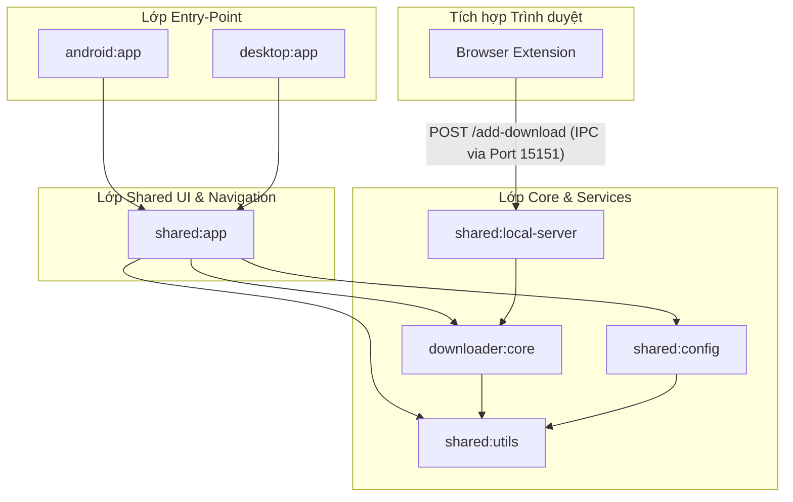
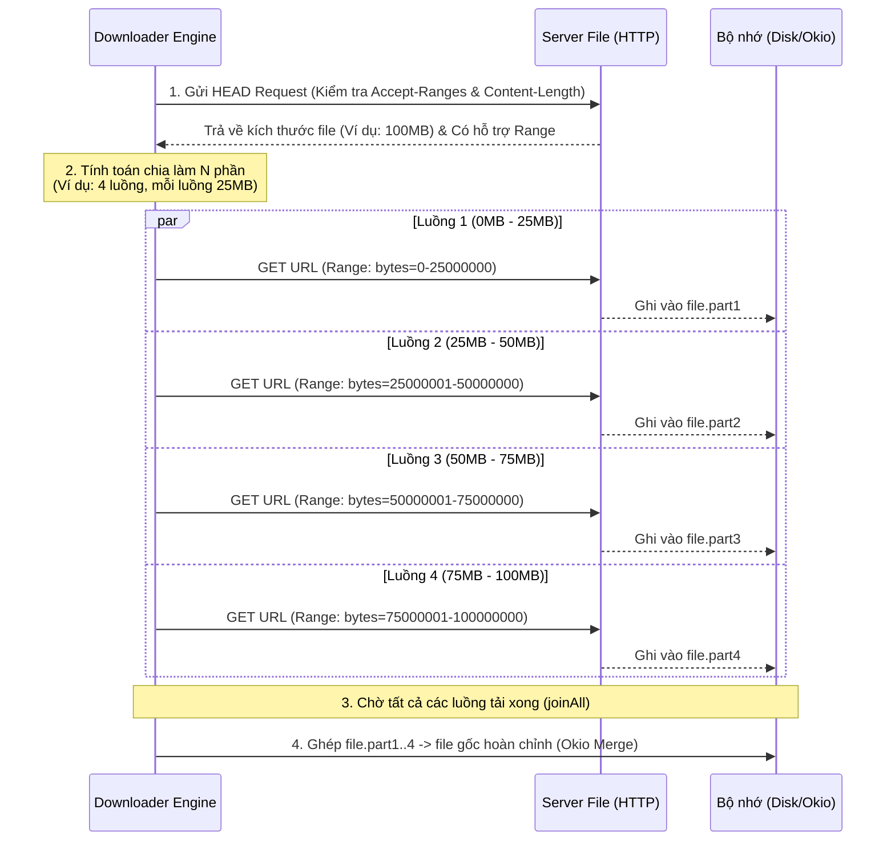

# Hướng dẫn Thuyết trình Kỹ thuật & Báo cáo Sơ bộ
## Đề tài: Ứng dụng Quản lý và Tăng tốc Tải xuống Flow Download Manager Đa nền tảng

Tài liệu này được biên soạn nhằm giúp bạn tự tin thuyết trình trước Hội đồng/Giảng viên hướng dẫn (**ThS. Trần Hải Long**). Nội dung tập trung làm rõ **tính học thuật, độ phức tạp kỹ thuật** và **các quyết định thiết kế kiến trúc** của dự án **Flow Download Manager** (`flowspeed.link`).

---

## 📌 PHẦN 1: BẢN ĐỒ THUYẾT TRÌNH (SLIDE-BY-SLIDE & SCRIPT)

### 🖥️ Slide 1: Giới thiệu Đề tài & Lý do Chọn đề tài
* **Tiêu đề Slide:** XÂY DỰNG ỨNG DỤNG QUẢN LÝ VÀ TĂNG TỐC TẢI XUỐNG FLOW DOWNLOAD MANAGER ĐA NỀN TẢNG
* **Nội dung chính:**
  * **Sinh viên thực hiện:** Lưu Lâm Công (K71 CNTT)
  * **GVHD:** ThS. Trần Hải Long
  * **Đặt vấn đề:**
    * Trình duyệt mặc định (Chrome/Edge): Tải đơn luồng (single connection), tốc độ chậm, mất mạng phải tải lại từ đầu, không tải được video HLS/m3u8.
    * Các phần mềm như IDM (Internet Download Manager): Đóng gói mã nguồn (closed-source), có chứa telemetry (thu thu thập dữ liệu người dùng), chỉ chạy trên Windows, mất phí bản quyền.
  * **Giải pháp:** Flow Download Manager - Một ứng dụng **đa nền tảng** (Windows, macOS, Linux, Android), **mã nguồn mở**, **tốc độ tải đa luồng tối đa**, **bảo mật thông tin người dùng tuyệt đối (Zero Telemetry)**.

> **💡 Kịch bản thuyết trình (Nói gì với Thầy):**
> *"Kính thưa Thầy và Hội đồng, đề tài của em tập trung giải quyết bài toán tối ưu hóa tốc độ tải file trên môi trường mạng. Hiện nay các trình duyệt chủ yếu tải đơn luồng nên rất chậm và dễ lỗi giữa chừng. Trong khi đó, công cụ phổ biến như IDM lại tốn phí và chỉ chạy trên Windows. Mục tiêu của em là xây dựng Flow Download Manager - một giải pháp mã nguồn mở, hỗ trợ tải đa luồng vượt trội, tải được cả luồng video phân đoạn HLS/m3u8, bảo mật tuyệt đối và đặc biệt chạy được trên cả Desktop và Android bằng công nghệ đa nền tảng hiện đại."*

---

### 🖥️ Slide 2: Công nghệ Sử dụng & Lợi thế Kiến trúc (Tech Stack)
* **Tiêu đề Slide:** ĐỀ XUẤT CÔNG NGHỆ & ĐA NỀN TẢNG (KMP & COMPOSE)
* **Nội dung chính:**
  * **Ngôn ngữ:** **Kotlin Multiplatform (KMP)** - Chia sẻ 100% logic tải xuống và xử lý dữ liệu giữa các nền tảng, biên dịch trực tiếp ra mã native thay vì dùng WebView/JS chậm chạp.
  * **UI Framework:** **Compose Multiplatform** - Vẽ trực tiếp các phần tử giao diện lên màn hình bằng thư viện đồ họa **Skia (Skiko)** giúp đạt tốc độ render cực cao (60 - 120 FPS).
  * **Điều hướng UI:** **Decompose Framework** - Quản lý trạng thái giao diện theo dạng Component-driven, giữ nguyên trạng thái màn hình khi xoay điện thoại hoặc thu nhỏ ứng dụng.
  * **Mạng & I/O:** **Ktor Client** + **OkHttp** + **Okio**. (OkHttp được tinh chỉnh để chạy HTTP/1.1 Range Requests phân đoạn thay vì HTTP/2 dồn kênh để tránh nghẽn luồng).
  * **Lưu trữ cấu hình:** **Jetpack DataStore** + **kotlinx.serialization** (Format JSON gọn nhẹ, bất đồng bộ hoàn toàn, loại bỏ SQLite cồng kềnh).

> **💡 Kịch bản thuyết trình (Nói gì với Thầy):**
> *"Điểm đặc biệt về công nghệ trong dự án này là em sử dụng Kotlin Multiplatform và Compose Multiplatform. Đây là xu hướng hiện đại cho phép viết code logic một lần nhưng biên dịch trực tiếp thành mã máy bản địa trên Windows, macOS, Linux và Android. Để xử lý bài toán hiệu năng giao diện, Compose Multiplatform sử dụng thư viện đồ họa Skia để vẽ trực tiếp UI, giúp ứng dụng mượt mà không thua kém app Native thuần túy. Về điều hướng, em áp dụng Decompose để chia nhỏ UI thành các Component độc lập, tự quản lý vòng đời (lifecycle) riêng."*

---

### 🖥️ Slide 3: Kiến trúc Hệ thống & Phân chia Module (Module Graph)
* **Tiêu đề Slide:** THIẾT KẾ KIẾN TRÚC HỆ THỐNG
* **Nội dung chính:**
  * Hệ thống gồm **17 Gradle Modules** được chia làm 3 lớp chính:
    1. **Lớp Entry-Points:** `android:app`, `desktop:app` (Kích hoạt luồng chạy chính).
    2. **Lớp Shared UI & Logic:** `shared:app` (Giao diện dùng chung), `shared:config` (Cấu hình), `shared:auto-start` (Khởi động cùng OS).
    3. **Lớp Core Engines:** `downloader:core` (Lõi tải đa luồng), `shared:local-server` (Local server giao tiếp với trình duyệt).
  * **Cơ chế IPC (Inter-Process Communication):** Tiện ích trình duyệt (Manifest V3 Extension) bắt link -> Gửi dữ liệu qua Local HTTP Server (http4k) chạy tại `localhost:15151` -> Downloader Engine khởi tạo tác vụ.

* **Sơ đồ Kiến trúc (Mô hình hóa bằng Mermaid):**

> **💡 Kịch bản thuyết trình (Nói gì với Thầy):**
> *"Đây là sơ đồ kiến trúc module của dự án, được chia làm các lớp độc lập giúp giảm thiểu sự phụ thuộc chéo (decoupling). Tầng trên cùng là các module chạy cho Android và Desktop. Tầng giữa là `shared:app` chứa toàn bộ giao diện và luồng xử lý điều hướng. Tầng dưới cùng là lõi kỹ thuật `downloader:core` và `shared:local-server`. Đặc biệt, để bắt link từ Chrome, em tự phát triển một Browser Extension. Extension này giao tiếp với ứng dụng desktop thông qua cơ chế IPC sử dụng Local HTTP Server chạy trên port 15151 của máy. Nhờ vậy, ngay khi người dùng bấm tải trên web, app sẽ tự động mở hộp thoại nhận link tải."*

---

### 🖥️ Slide 4: Cơ chế Tăng tốc Đa luồng (Core Downloader Engine)
* **Tiêu đề Slide:** NGUYÊN LÝ TẢI ĐA LUỒNG & GHÉP NỐI TỆP TIN
* **Nội dung chính:**
  * **Nguyên lý Range Requests:** Sử dụng HTTP Header `Range: bytes=start-end` để yêu cầu máy chủ trả về phân đoạn dữ liệu mong muốn.
  * **Xử lý Bất đồng bộ:** Sử dụng **Kotlin Coroutines** (`Dispatchers.IO`) khởi chạy song song nhiều luồng tải các phân đoạn (`HttpDownloadJob.kt`).
  * **Ghép nối file tối ưu:** Sử dụng thư viện **Okio** để đọc ghi file trực tiếp ở mức nhị phân ở tốc độ cực cao, giảm thiểu thời gian merge file sau khi tải xong.
  * **Cơ chế Hàng đợi (Smart Queues):** Lập lịch thời gian chạy, cấu hình băng thông động cho từng hàng đợi.

* **Sơ đồ Quy trình tải đa luồng:**

> **💡 Kịch bản thuyết trình (Nói gì với Thầy):**
> *"Ở slide này, em xin trình bày sâu hơn về cơ chế tải đa luồng của hệ thống. Trước khi tải, engine sẽ gửi một yêu cầu HEAD để xác định xem server có hỗ trợ tải đa luồng (HTTP Header `Accept-Ranges` có tồn tại) và lấy tổng kích thước file. Sau đó, file sẽ được chia thành nhiều phần bằng nhau. Em sử dụng Kotlin Coroutines để chạy song song nhiều luồng kết nối tải đồng thời các phần file. Các phần file tạm thời này được ghi trực tiếp xuống ổ đĩa. Khi tất cả các luồng chạy xong, hệ thống sẽ sử dụng thư viện Okio để ghép nối các tệp phân đoạn thành tệp gốc một cách nhanh chóng mà không làm tràn bộ nhớ RAM."*

---

### 🖥️ Slide 5: Triết lý Thiết kế Cyber-Industrial UI (Brutalist Tech)
* **Tiêu đề Slide:** GIAO DIỆN CYBER-INDUSTRIAL ĐỘT PHÁ
* **Nội dung chính:**
  * Triết lý **Brutalist Tech / Cyber-Industrial**: Mang lại trải nghiệm kỹ thuật, thô mộc, góc cạnh.
  * **Sắc cạnh & Không bo tròn:** Thiết lập `BorderRadius.zero` trên toàn hệ thống.
  * **Nút bấm vát góc 45 độ (Chamfered Accents):** Thiết kế nút bấm đặc thù bằng toán học vector thay cho góc tròn truyền thống.
  * **Font chữ kỹ thuật:** `Orbitron` cho các tiêu đề/thương hiệu và `JetBrains Mono` cho dữ liệu số liệu tốc độ để tạo cảm giác chuyên nghiệp.
  * **Màu sắc tương phản cao:** Nền tối sâu `#0A0A0A` kết hợp màu cam neon nhấn mạnh `#E64A00`. Hỗ trợ 6 themes giao diện linh hoạt.

> **💡 Kịch bản thuyết trình (Nói gì với Thầy):**
> *"Khác với các ứng dụng hiện nay thường chạy theo phong cách bo tròn mềm mại của Material Design hoặc iOS, Flow sử dụng triết lý thiết kế Cyber-Industrial. Mọi nút bấm đều sắc cạnh, các nút bấm chính được vát góc 45 độ bằng Custom Path vẽ tay. Font chữ sử dụng JetBrains Mono mang đậm phong cách lập trình, hiển thị tốc độ tải và dung lượng rõ ràng. Ngoài ra, giao diện hỗ trợ tới 6 chủ đề màu sắc khác nhau, tối ưu cả chế độ sáng và chế độ tối."*

---

### 🖥️ Slide 6: Kết quả Thực nghiệm & Hướng phát triển
* **Tiêu đề Slide:** THỬ NGHIỆM ĐO LƯỜNG & ĐỊNH HƯỚNG PHÁT TRIỂN
* **Nội dung chính:**
  * **Thực nghiệm tải file 1.2 GB** từ máy chủ FPT:
    * Trình duyệt Chrome (1 luồng): Mất **2 phút 30 giây** (Tốc độ TB: 8.2 MB/s).
    * Flow Download Manager (8 luồng): Chỉ mất **1 phút 43 giây** (Tốc độ TB: 11.8 MB/s) -> **Nhanh hơn ~35%**.
    * Thời gian ghép file (Okio Merge): Chỉ mất **1.5 - 1.8 giây**.
  * **Kết luận:** Hệ thống chạy ổn định, chiếm dụng RAM thấp (dưới 60MB ở chế độ chạy ngầm trên Desktop).
  * **Định hướng tương lai:**
    * Tích hợp giao thức tải xuống ngang hàng Peer-to-Peer (BitTorrent).
    * Bổ sung tính năng tự động quét virus sau khi tải xong bằng API của bên thứ ba.
    * Đưa ứng dụng lên Google Play Store và Windows Store.

> **💡 Kịch bản thuyết trình (Nói gì với Thầy):**
> *"Để chứng minh tính thực tế của đề tài, em đã tiến hành đo đạc thực nghiệm tải file dung lượng 1.2GB. Kết quả cho thấy Flow Download Manager tối ưu hóa và tận dụng băng thông tốt hơn, giúp rút ngắn thời gian tải xuống đến 35% so với trình duyệt mặc định. Thời gian ghép file cũng chỉ mất chưa đến 2 giây nhờ tối ưu hóa tầng I/O. Hướng phát triển tiếp theo của em là sẽ hỗ trợ tải tệp BitTorrent (torrent) và tích hợp các công cụ quét mã độc tự động để bảo vệ người dùng."*

---

## 📌 PHẦN 2: CÁC CÂU HỎI THƯỜNG GẶP (Q&A) CỦA GIẢNG VIÊN & CÁCH TRẢ LỜI

**Câu hỏi 1: Tại sao em lại chọn Kotlin Multiplatform (KMP) thay vì Flutter hay React Native?**
* **Trả lời:** *“Dạ thưa Thầy, Flutter và React Native rất mạnh về giao diện nhưng lại chạy qua cầu nối (bridge) hoặc máy ảo riêng để giao tiếp với hệ thống. Đối với một ứng dụng tải file tốc độ cao, chúng ta cần can thiệp sâu vào I/O, quản lý file nhị phân và luồng mạng. KMP cho phép em viết logic tải file bằng Kotlin nhưng biên dịch thẳng ra mã máy bản địa (native bytecode) cho từng OS, mang lại hiệu năng tối đa tương đương viết app native bằng C++ hay Rust nhưng lại tiết kiệm được thời gian nhờ tái sử dụng được logic UI.”*

**Câu hỏi 2: Cơ chế bắt link tải từ trình duyệt hoạt động như thế nào? Có an toàn không?**
* **Trả lời:** *“Dạ, Browser Extension sử dụng Manifest V3 của Chrome để bắt sự kiện tải xuống. Khi phát hiện link tải lớn hơn 1MB, nó tạm dừng trình tải của trình duyệt và gửi một HTTP POST request nội bộ đến Local Server chạy tại cổng `localhost:15151` trên máy. Máy chủ này chỉ lắng nghe các kết nối từ nội bộ máy (`127.0.0.1`), không mở cổng ra ngoài Internet nên hoàn toàn bảo mật và không bị kẻ xấu khai thác.”*

**Câu hỏi 3: Nếu máy chủ không hỗ trợ Range Requests (tải đa luồng) thì Flow xử lý thế nào?**
* **Trả lời:** *“Dạ, trước khi bắt đầu, Flow gửi một yêu cầu `HEAD` đến server để kiểm tra xem server có gửi lại header `Accept-Ranges: bytes` hay không. Nếu không có hoặc server phản hồi không hỗ trợ, Flow sẽ tự động fallback về cơ chế tải đơn luồng (single connection) để đảm bảo tệp tin vẫn được tải về thành công mà không bị lỗi cấu trúc file.”*

**Câu hỏi 4: Làm thế nào em tối ưu hóa tốc độ ghép file sau khi tải xong?**
* **Trả lời:** *“Dạ, thông thường các app tải file khác ghi các mảnh tạm thời rồi đọc lại toàn bộ và ghi vào file đích, gây tốn tài nguyên ổ cứng. Trong Flow, em sử dụng thư viện **Okio** để mở luồng ghi (Sink) trực tiếp nối tiếp các file phân đoạn mà không cần load toàn bộ file vào bộ nhớ RAM. Do đó việc ghép nối diễn ra cực kỳ nhanh (dưới 2 giây cho file 1.2GB) và không gây đơ máy.”*
