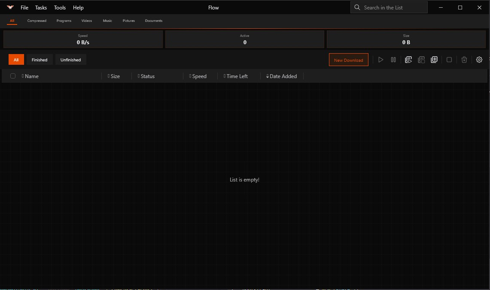
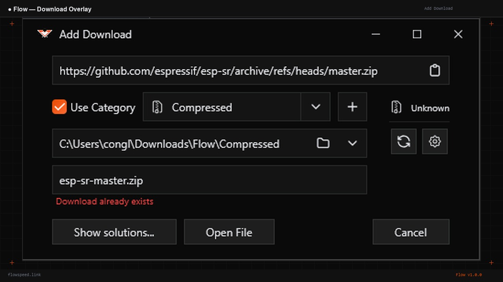
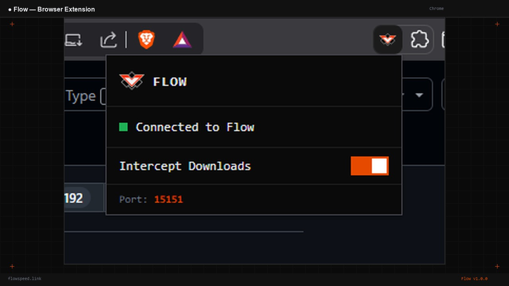
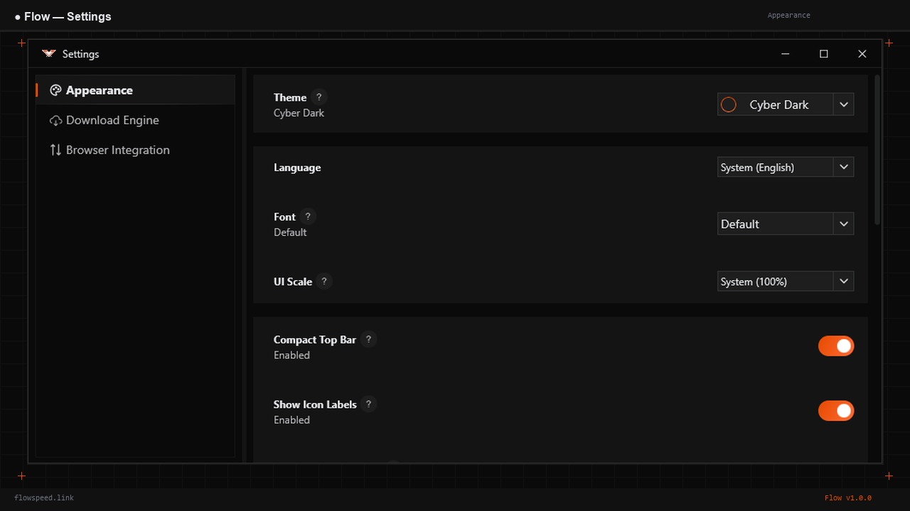

<p align="center">
  
</p>

<h1 align="center">Flow Download Manager</h1>

<p align="center">
  <strong>Download at the speed of thought.</strong><br>
  A blazing-fast, open-source download manager for Windows, macOS, Linux and Android.
</p>

<p align="center">
  <a href="https://github.com/luuconghoangnam/flowspeed.link/releases/latest"></a>
  <a href="https://github.com/luuconghoangnam/flowspeed.link/blob/main/LICENSE"></a>
  <a href="https://github.com/luuconghoangnam/flowspeed.link/actions"></a>
  <a href="https://flow.getdrops.link"></a>
</p>

---

## Screenshots

<p align="center">
  
</p>

<p align="center">
  
  
</p>

<p align="center">
  
</p>

---

## Features

- **Multi-threaded Engine** — Splits files into parallel streams, up to 10x faster than browser downloads
- **Smart Queues** — Multiple queues with bandwidth limits, scheduling, and auto-actions on completion
- **Browser Extension** — Chrome, Edge, Brave. Hover any link → Flow button appears → one click download
- **Cyber-Industrial UI** — Sharp corners, high contrast, orange accent. 5 themes included
- **Cross-platform** — Windows, macOS, Linux (desktop) + Android
- **System Tray** — Runs silently in background, auto-starts on boot
- **Zero Telemetry** — No analytics, no ads, no subscriptions. Fully offline
- **HLS Support** — Download m3u8/HLS streams in addition to HTTP/HTTPS

---

## Download

| Platform | Download | Architecture |
|----------|----------|-------------|
| 🪟 Windows | [`.msi` Installer](https://github.com/luuconghoangnam/flowspeed.link/releases/latest) | x64, ARM64 |
| 🍎 macOS | [`.dmg` Installer](https://github.com/luuconghoangnam/flowspeed.link/releases/latest) | Intel, Apple Silicon |
| 🐧 Linux | [`.deb` Package](https://github.com/luuconghoangnam/flowspeed.link/releases/latest) | x64, ARM64 |
| 📱 Android | [`.apk` Download](https://github.com/luuconghoangnam/flowspeed.link/releases/latest) | Universal |

> Or visit [flow.getdrops.link](https://flow.getdrops.link) for the full landing page.

---

## Browser Extension

The Flow browser extension intercepts downloads before the browser's save dialog appears.

- Auto-intercepts files > 1MB
- Hover overlay button with neon glow on download links
- Works with Chrome, Edge, Brave (Chromium-based)
- Communicates with Flow app via `localhost:15151`
- Toggle on/off from the popup

Install from the [Chrome Web Store](#) or load unpacked from the `extension/` folder.

---

## Build from Source

### Requirements
- JBR (JetBrains Runtime) 21 or JDK 21
- Gradle 9.x (wrapper included)

### Desktop
```bash
# Clone
git clone https://github.com/luuconghoangnam/flowspeed.link.git
cd flowspeed.link

# Build for current OS
./gradlew desktop:app:packageMsi          # Windows
./gradlew desktop:app:packageDmg          # macOS
./gradlew desktop:app:packageDeb          # Linux

# Run directly
./gradlew desktop:app:run
```

### Android
```bash
./gradlew android:app:assembleDebug
# APK at: android/app/build/outputs/apk/debug/
```

### CI Build (all platforms)
```bash
./gradlew createReleaseFolderForCi
# Output at: build/ci-release/binaries/
```

---

## Project Structure

```
flowspeed.link/
├── android/app/          # Android app module
├── desktop/app/          # Desktop app (Windows, macOS, Linux)
├── shared/               # Shared Kotlin Multiplatform code
│   ├── app/              # Shared UI, pages, themes
│   ├── config/           # App configuration
│   └── resources/        # Shared resources
├── extension/            # Chrome browser extension
├── landing/              # Landing page (flow.getdrops.link)
├── scripts/              # Build & install scripts
└── installer/            # Inno Setup script (Windows)
```

---

## Tech Stack

- **Language**: Kotlin Multiplatform
- **UI Framework**: Jetpack Compose (Desktop + Android)
- **Build**: Gradle with convention plugins
- **Architecture**: Component-based with Decompose
- **DI**: Koin
- **Networking**: Ktor
- **Serialization**: kotlinx.serialization

---

## Contributing

1. Fork the repository
2. Create a feature branch (`git checkout -b feature/my-feature`)
3. Commit your changes
4. Push to the branch
5. Open a Pull Request

---

## License

```
Copyright (c) 2025 Luu Cong Hoang Nam
Licensed under the Apache License, Version 2.0
```

See [LICENSE](LICENSE) for the full text.

---

<p align="center">
  Made with ⚡ and ☕ by <a href="https://github.com/luuconghoangnam">Luu Cong Hoang Nam</a>
</p>
